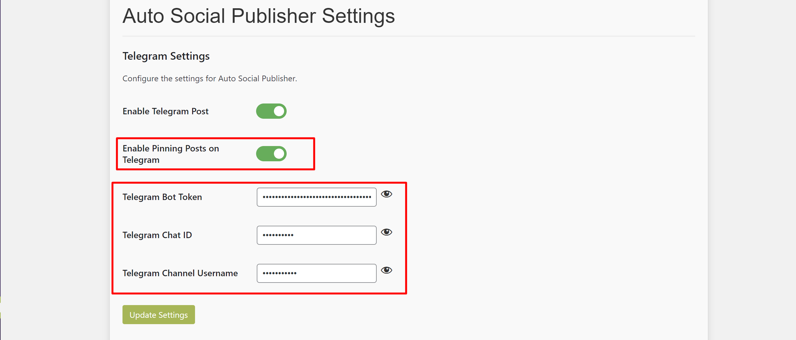

# Auto Social Publisher WordPress Plugin

**Auto Social Publisher** is a powerful WordPress plugin that automatically publishes new and updated posts to Telegram with advanced features. Version 2.0.0 introduces a premium dashboard, post pinning, and improved settings management.

---

## Key Features

- **Automated Telegram Posting**: Automatically share new or updated WordPress posts directly to your Telegram channel or chat.
- **Premium Dashboard**: Manage your post notifications and settings more efficiently through a new, user-friendly dashboard (added in v2.0.0).
- **Post Pinning on Telegram**: Automatically pin posts to your Telegram channel and unpin previous ones for seamless post management.
- **AJAX-Based Settings**: Save and update plugin settings without refreshing the page.
- **Enhanced Media Support**: Send featured images along with your post title and summary to Telegram.

---

## What's New in Version 2.0.0

- **Premium Dashboard**: Enjoy a brand-new dashboard that allows for easier control of your Telegram post settings.
- **Post Pinning Feature**: Automatically pin posts on Telegram and unpin previous posts with ease.
- **Bug Fixes**: Fixed minor bugs and improved overall plugin performance.
- **AJAX Enhancements**: Settings now update without needing a page reload, providing a smoother user experience.

---

## Installation

1. Download the plugin ZIP file from the [latest release](https://github.com/ashrafulwpdev/auto-social-publisher/releases).
2. Navigate to `Plugins > Add New > Upload Plugin` in your WordPress dashboard.
3. Upload the ZIP file and click "Activate" to enable the plugin.

---

## Configuration

1. Go to `Settings > Auto Social Publisher` in your WordPress admin.
2. Enter your **Telegram bot token**, **chat ID**, or **channel username** (without @).
3. Enable automatic Telegram posting by checking the "Enable Telegram Auto Post" option.
4. (Optional) Enable the "Pin Posts on Telegram" option to pin posts automatically.

---

## Usage

1. Create or update posts as usual in WordPress.
2. Posts will be automatically sent to your configured Telegram channel or chat with a **title**, **summary**, and **featured image**.
3. If enabled, the post will be pinned to the top of the Telegram channel and previous pins will be automatically unpinned.

---

## Screenshots

### Premium Dashboard

Here’s a look at the brand-new **Premium Dashboard**, providing better control over your plugin settings:

### Post Pinning Feature

See how posts are automatically pinned to your Telegram channel:

---

## Changelog

### Version 2.0.0

- **New Feature**: Premium dashboard for managing settings and notifications.
- **New Feature**: Post pinning on Telegram, with automatic unpinning of old posts.
- **Bug Fixes**: Minor bugs fixed from version 1.0.5.
- **Improvement**: AJAX-based settings update for a smoother user experience.

### Version 1.0.5

- Initial public release with automatic Telegram post notifications.

---

## Support

If you encounter any issues or have feature requests, please [open an issue on GitHub](https://github.com/ashrafulwpdev/auto-social-publisher/issues/new). We welcome feedback to continue improving the plugin.

---

## License

This project is licensed under the **GNU General Public License v2.0**. For more details, check the [LICENSE](LICENSE) file.

---

## Managed By

Developed and managed by **[TechSwiftSoft.com](https://techswiftsoft.com)**, specialists in WordPress plugin development and web services.

---

## Support Email

For direct support, you can reach us at **support@techswiftsoft.com**. We aim to respond to all inquiries within 24-48 hours.

---

## Current Version

**Version: 2.0.0**

